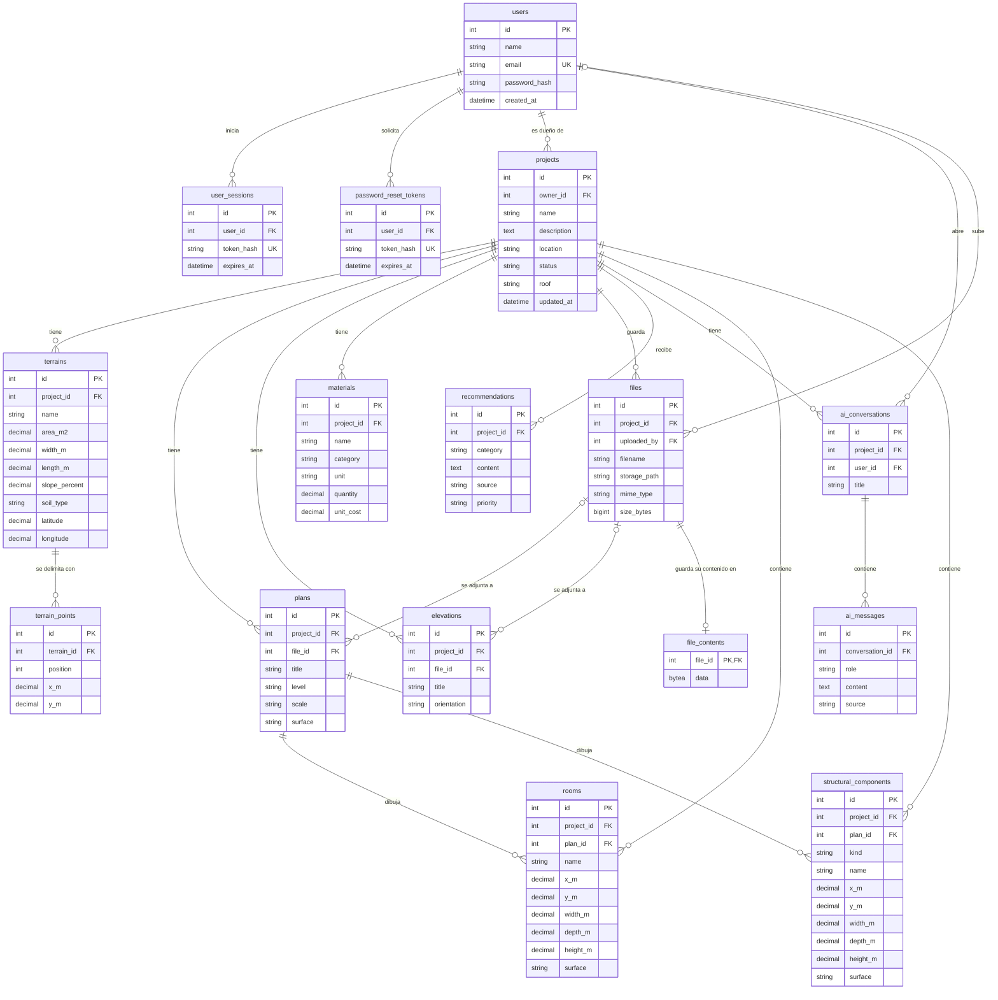

# BASE DE DATOS

## Motor

PostgreSQL.

## Acceso

SQLAlchemy.

## Organización

```text
BASE-DE-DATOS-ARQUILA/
├── migrations/
│   ├── 001_initial_schema.sql
│   ├── 002_password_reset_tokens.sql
│   ├── 003_terrain_points.sql
│   ├── 004_ai_message_source.sql
│   ├── 005_rooms.sql
│   ├── 006_structural_components.sql
│   ├── 007_recommendation_priority.sql
│   ├── 008_element_surfaces.sql
│   ├── 009_project_roof.sql
│   ├── 010_file_contents.sql
│   ├── 011_runtime_state.sql
│   ├── 012_roles_and_permissions.sql
│   ├── 013_properties_and_units.sql
│   ├── 014_spatial_elements.sql
│   └── 015_walkthrough_and_renovation.sql
└── seed.sql
```

## Diagrama entidad-relación

Las quince tablas y sus relaciones. Todo cuelga de `projects`, y cada proyecto de su dueño en `users`: al eliminar un proyecto se eliminan sus terrenos, planos, elevaciones, materiales, archivos, recomendaciones y conversaciones. Se omiten las columnas `created_at`, presentes en casi todas las tablas.



- Un archivo se puede adjuntar a varios planos o elevaciones; si se elimina, estos quedan sin archivo (`file_id` vacío) pero no se eliminan.
- Un cuarto y un componente estructural pertenecen a un plano y, por comodidad de las consultas, guardan también el proyecto.
- `user_sessions` y `password_reset_tokens` guardan solo el hash del identificador, nunca el valor que recibe el navegador.
- La tabla `schema_migrations`, que anota las migraciones aplicadas, no aparece porque no pertenece al modelo de la aplicación.
- La tabla `runtime_state` tampoco aparece: guarda en JSON el historial de «Deshacer» y los intentos de inicio de sesión cuando el backend no puede tenerlos en memoria, y no se relaciona con ninguna otra.

## Corrida de interior, obras y roles

Las migraciones 012 a 015 añaden estas tablas, que todavía no están dibujadas en el diagrama de arriba:

| Tabla | Qué guarda | Se relaciona con |
|---|---|---|
| `roles`, `permissions`, `role_permissions`, `user_roles` | Control de acceso por roles. La migración 012 carga tres roles (`admin`, `architect`, `viewer`) y nueve permisos. | `users` |
| `properties` | El inmueble de un proyecto: tipo, dirección, estado y `spatial_metadata` (JSONB). | `projects` |
| `units` | Unidades del inmueble: código, nivel, estado, precio, área, `model_asset_ref` y `asset_config` (JSONB). | `properties` |
| `spatial_elements` | Elementos de una capa (`structure`, `installations`, `finishes`) con su caja envolvente en metros, su estado de obra (`existing`, `planned`, `demolition`), la malla y `config` (JSONB). | `projects`, `rooms` |
| `walkthrough_steps` | Paradas de la corrida de interior, en orden, con su duración y `view_config` (JSONB). | `projects`, `rooms` |
| `renovation_logs` | Obras previstas o en curso: capa, estado, fechas y coste estimado. | `projects`, `rooms`, `spatial_elements`, `users` |

La tabla `rooms` gana `unit_id`, `category` y `mesh_ref`.

- **Borrado**: eliminar un proyecto elimina todo lo anterior. Eliminar un cuarto, una unidad o un elemento espacial no elimina lo que lo referencia: la referencia queda vacía (`ON DELETE SET NULL`), para no perder el registro de obras.
- **Índices espaciales**: `rooms` y `spatial_elements` tienen un índice GiST sobre la caja de su planta, `box(point(min_x, min_y), point(max_x, max_y))`. Usa los tipos geométricos propios de PostgreSQL, así que no hace falta instalar PostGIS. El backend consulta con el operador `&&` sobre esa misma expresión.
- **Claves foráneas**: todas tienen índice. Las que admiten vacío usan un índice parcial (`WHERE ... IS NOT NULL`), y `properties.project_id` y `units.property_id` quedan cubiertas por su restricción `UNIQUE`.
- **JSONB**: cada columna exige que el valor sea un objeto (`jsonb_typeof(...) = 'object'`). No tienen índice GIN porque ninguna consulta filtra por su contenido.
- **Importación repetible**: `(project_id, source, external_id)` es único cuando hay `external_id`, de modo que volver a importar un archivo actualiza los elementos en lugar de duplicarlos.
- Los archivos de migración y `seed.sql` no pueden contener el signo de porcentaje: el backend los ejecuta con psycopg, que lo interpreta como marcador de parámetro.

## Migraciones

El esquema de la base de datos se define con archivos SQL numerados en `migrations/`. Cada archivo es un cambio y se aplica una sola vez, en orden.

Para crear las tablas en una base nueva, o actualizar una existente:

```bash
cd BACKEND-ARQUILA
python -m app.migrate
```

Sin el backend, `bash scripts/init.sh` hace lo mismo con `psql` (ver el `README.md`).

El comando lee `DATABASE_URL` de `BACKEND-ARQUILA/.env`, el mismo archivo que usa el arranque del backend, así que no hay que definirla en la terminal. Si se define en la terminal, ese valor tiene prioridad.

Con `python -m app.migrate --seed` se cargan además los datos de ejemplo de `seed.sql`: un usuario de demostración con tres proyectos, sus terrenos, planos, elevaciones, materiales y notas. «Casa Los Arrayanes» trae además 17 cuartos, 16 columnas y 8 vigas en sus dos plantas, y «Edificio Mirador» 16 cuartos y 24 columnas en cuatro pisos con cubierta plana, para que el modelo 3D se vea completo sin cargar nada a mano. «Cabaña Mindo» no tiene cuartos. Se puede ejecutar varias veces sin duplicar nada.

El usuario de demostración es `demo@example.com` con contraseña `arquila-demo`. Es una credencial pública, pensada solo para desarrollo: no se debe cargar `seed.sql` en una base con datos reales ni en un servidor accesible desde internet.

El script (`BACKEND-ARQUILA/app/migrate.py`) anota cada archivo aplicado en la tabla `schema_migrations`, y en cada ejecución aplica solo los que faltan. Cada migración corre dentro de una transacción: si falla, no queda anotada y el proceso se detiene.

Para cambiar el esquema:

1. Crear un archivo nuevo con el siguiente número, por ejemplo `002_add_project_budget.sql`.
2. Hacer el mismo cambio en `BACKEND-ARQUILA/app/models.py`.
3. Ejecutar `python -m app.migrate`.

Un archivo ya aplicado no se debe modificar: el script no lo volvería a ejecutar. Los cambios siempre van en un archivo nuevo.

No hay migraciones de reversa. Para deshacer un cambio se escribe una migración nueva que lo revierta.

## Principios

- Separar persistencia de lógica de negocio.
- Validar entradas.
- Evitar credenciales dentro del código.
- Utilizar variables de entorno.
- Mantener relaciones y restricciones documentadas.
